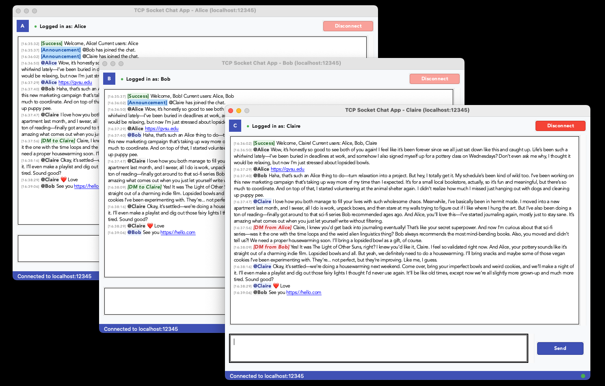

# TCP Socket Chat Application

A lightweight, multi-threaded chat application built on TCP sockets to enable real-time group communication.



## Table of Contents

-   [TCP Socket Chat Application](#tcp-socket-chat-application)
    -   [Table of Contents](#table-of-contents)
    -   [Features](#features)
    -   [Architecture Overview](#architecture-overview)
    -   [Server Design](#server-design)
        -   [Data Structures](#data-structures)
        -   [Server Operations](#server-operations)
        -   [Client Handler Operations](#client-handler-operations)
    -   [Client Design](#client-design)
        -   [Components](#components)
        -   [Client Operations](#client-operations)
        -   [User Interface Features](#user-interface-features)
    -   [Extra Credits Features](#extra-credits-features)
        -   [1. Enhanced UI Presentation](#1-enhanced-ui-presentation)
        -   [2. URL Detection and Clickable Links](#2-url-detection-and-clickable-links)
        -   [3. Emoji Shortcode Support](#3-emoji-shortcode-support)
        -   [4. Direct Messaging](#4-direct-messaging)
    -   [Running the Application](#running-the-application)
        -   [Requirements](#requirements)
        -   [Starting the Server](#starting-the-server)
        -   [Starting the Client](#starting-the-client)
        -   [SSH Tunneling (for remote connections)](#ssh-tunneling-for-remote-connections)
    -   [Team Contributions](#team-contributions)
        -   [Team Members](#team-members)
        -   [Responsibilities Breakdown](#responsibilities-breakdown)
            -   [Minh Tran](#minh-tran)
            -   [Elijah Morgan](#elijah-morgan)
    -   [Development Process](#development-process)
        -   [Testing Strategy](#testing-strategy)
        -   [Challenges and Solutions](#challenges-and-solutions)
    -   [License](#license)

## Features

-   Multi-threaded server handling multiple simultaneous connections
-   User-friendly ['Tkinter'](https://docs.python.org/3/library/tkinter.html) GUI
-   Real-time messaging with automatic chat scrolling
-   Direct messaging between users via `@username` syntax
-   Automatically detects and converts URLs in messages into clickable links
-   Emoji shortcode support (e.g., `:thumbsup:` → 👍)
-   Status updates for user join/leave events
-   Clean connection handling for both server and clients

## Architecture Overview

The application follows a client-server architecture with a multi-threaded server that handles connections from multiple clients. The communication is established using TCP sockets.

## Server Design

### Data Structures

The server maintains several key data structures:

1. **Active Clients Dictionary**:

-   Maps client sockets to tuples of (username, address)
-   Used for message routing and user tracking
-   Protected by a thread lock to ensure thread-safe operations

```python
self.active_clients: Dict[socket.socket, Tuple[str, _RetAdress]] = {}
with self.clients_lock:
	self.active_clients[self.client_socket] = (self.username, self.addr)
```

2. **Client Thread Dictionary**:

-   Maps client sockets to their respective handler threads
-   Used for thread management and cleanup

```python
thread = threading.Thread(target=handler.handle)
thread.daemon = True
self.client_threads[client_socket] = thread
thread.start()
```

### Server Operations

1. **Starting the Server**:

    - Initializes the socket with TCP/IP protocol
    - Binds to the specified host and port
    - Listens for incoming connections
    - Sets socket options for address reuse

2. **Connection Handling**:

    - Accepts incoming client connections
    - Creates a new [`ClientHandler`](https://github.com/minhtran241/tcp-socket-chat/blob/main/server/client_handler.py) for each connection
    - Starts a dedicated thread for each client

3. **Broadcasting Messages**:

    - Sends messages to all connected clients except the sender
    - Identifies and removes dead connections
    - Thread-safe execution with lock management

4. **Server Cleanup**:
    - Gracefully closes all client connections
    - Shuts down the server socket

### Client Handler Operations

The [`ClientHandler`](https://github.com/minhtran241/tcp-socket-chat/blob/main/server/client_handler.py) class manages individual client connections:

1. **Connection Setup**:

    - Receives and validates username
    - Checks for duplicate usernames
    - Adds client to active clients dictionary
    - Sends welcome message and current user list

2. **Message Processing**:

    - Identifies message types (regular vs. direct messages)
    - Routes messages to appropriate recipients
    - Handles client disconnections

3. **Direct Messaging**:
    - Parses direct message format (`@username message`)
    - Locates target user's socket
    - Sends formatted message to recipient and confirmation to sender

## Client Design

### Components

The client consists of several modular components:

1. **ChatClient**: Core client logic managing connections and message flow
2. **LoginGUI**: Handles user login interface
3. **ChatGUI**: Manages the chat interface with message display and input
4. **Theme Manager**: Controls visual appearance

### Client Operations

1. **Connection Management**:

    - Establishes socket connection with server
    - Sends username for identification
    - Handles disconnection events

2. **Message Handling**:

    - Receives messages in a dedicated thread
    - Places messages in a thread-safe queue
    - Processes messages for display in the UI

3. **Message Categorization**:

    - Regular messages are displayed in the main chat area
    - Direct messages are highlighted and color-coded
    - System messages: `INFO` 📌 | `SUCCESS` ✅ | `ANNOUNCEMENT` 📢 | `WARNING` ⚠️ | `ERROR` ❌

    > Note: Please refer to [`client/theme.py`](https://github.com/minhtran241/tcp-socket-chat/blob/main/client/theme.py) for the complete list of message types and their formatting.

4. **UI Operations**:
    - Login screen for server connection details
    - Chat interface with separated input and display areas
    - Status indicators for connection state
    - Message formatting based on type (regular, DM, system messages)

### User Interface Features

1. **Login Screen**:

    - Username input
    - Server port configuration
    - Connect button with error handling

2. **Chat Interface**:
    - Header with username and connection details
    - Message display area with automatic scrolling
    - Input area with send button
    - Status bar showing connection state
    - Disconnect button

## Extra Credits Features

### 1. Enhanced UI Presentation

-   User avatars with initials
-   Color-coded messages by type (regular, DM, system messages)
-   Status indicators for connection state
-   Timestamp prefixes for all messages

### 2. URL Detection and Clickable Links

-   Automatic detection of URLs in messages
-   Clickable hyperlinks that open in the default browser
-   Maintains formatting for the rest of the message

### 3. Emoji Shortcode Support

-   Real-time emoji conversion as users type
-   Supports common emoji shortcodes (e.g., `:smile:`, `:thumbsup:`)
-   Preserves cursor position during conversion

### 4. Direct Messaging

-   Allows users to send private messages using `@username` syntax
-   Color-coded display for incoming and outgoing DMs
-   Confirmation messages for sender

## Running the Application

### Requirements

1. Install the `uv` package manager [here](https://docs.astral.sh/uv/getting-started/installation/)
2. Install python 3.13+ using `uv` [here](https://docs.astral.sh/uv/guides/install-python/)
3. Install the required packages:

    ```bash
    uv pip install -r pyproject.toml
    ```

### Starting the Server

```bash
uv run main.py server --host <host> --port <port>
```

By default, the server runs on localhost port 12345. You can modify these settings in [`common/constants.py`](https://github.com/minhtran241/tcp-socket-chat/blob/main/common/constants.py).

### Starting the Client

```bash
uv run main.py client --host <host> --port <port>
```

The client will display a login screen where you can enter your username and server details.

### SSH Tunneling (for remote connections)

To connect to a server on a remote machine like the GVSU EOS servers:

```bash
# Replace zzzzzzzz with your EOS/DC userid
ssh -N -L 5000:localhost:5000 zzzzzzzz@eos20.cis.gvsu.edu &
```

## Team Contributions

### Team Members

-   **Minh Tran**: Server implementation and extra credit features
-   **Elijah Morgan**: GUI implementation, documentation, and server hosting.

### Responsibilities Breakdown

#### Minh Tran

-   Designed and implemented the multi-threaded server architecture
-   Created the message routing and broadcasting system
-   Implemented direct messaging functionality
-   Added URL detection and clickable links feature
-   Developed emoji shortcode processing system

#### Elijah Morgan

-   Designed and implemented the Tkinter GUI components
-   Created login screen and chat interface
-   Handled message formatting and display
-   Prepared project documentation and testing
-   Handled networking and server hosting for final demo

## Development Process

### Testing Strategy

-   Server testing with multiple simultaneous connections
-   Client testing on different operating systems
-   Edge case handling (disconnections, errors)
-   Performance testing with increasing numbers of clients

### Challenges and Solutions

-   **Challenge**: Thread-safe client management  
    **Solution**: Implemented mutex locks for shared data structures

-   **Challenge**: Handling unexpected disconnections  
    **Solution**: Added timeout detection and clean reconnection logic

-   **Challenge**: Real-time UI updates without blocking  
    **Solution**: Used message queue and separate UI update timer

## License

This project was created for educational purposes as part of a programming assignment at Grand Valley State University.
